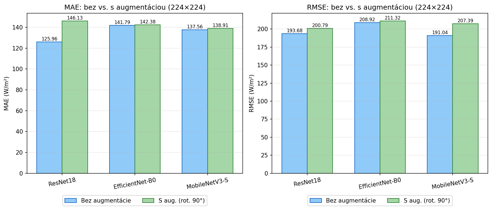
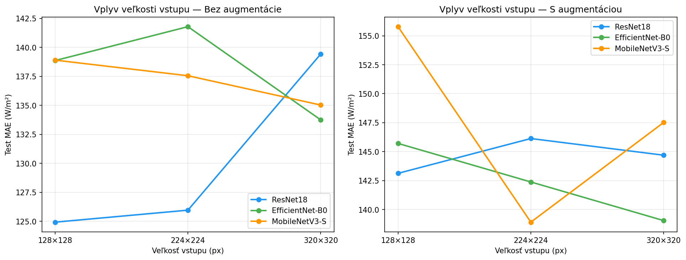
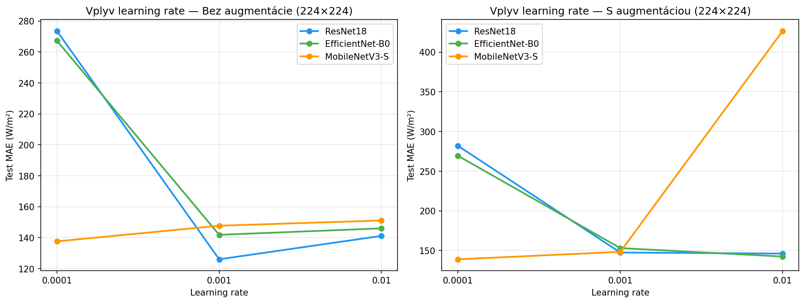
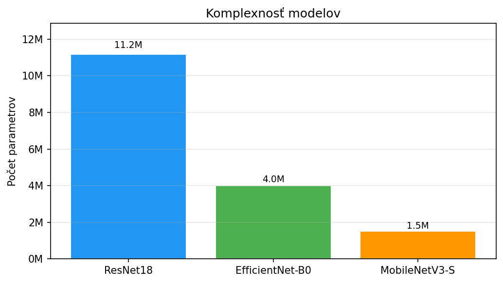
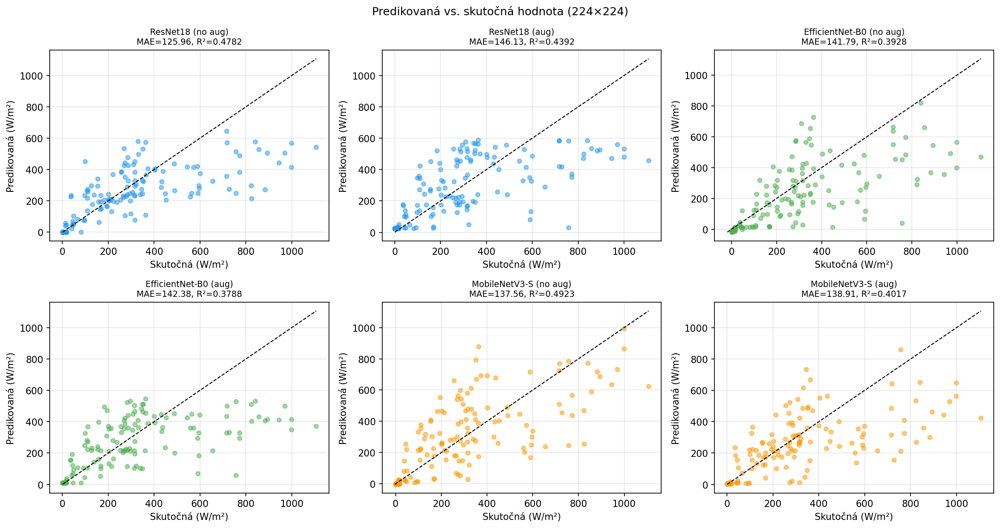
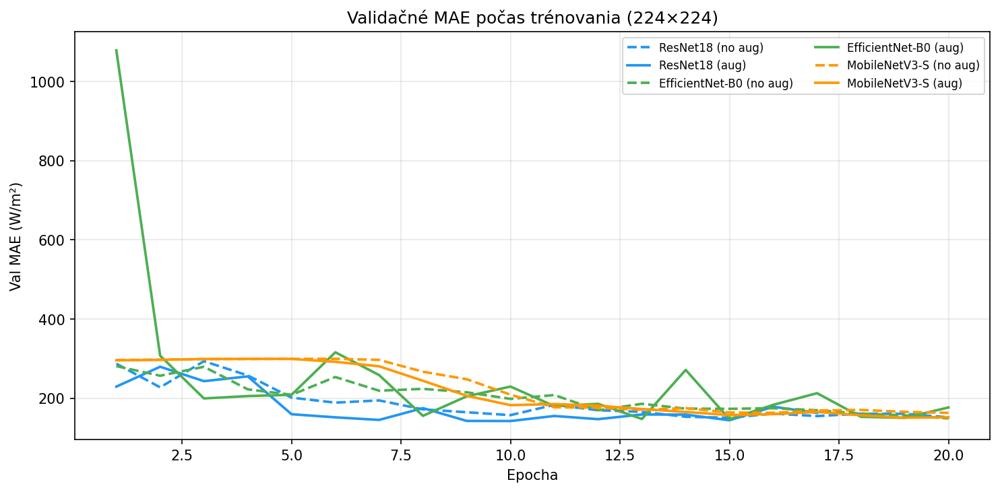
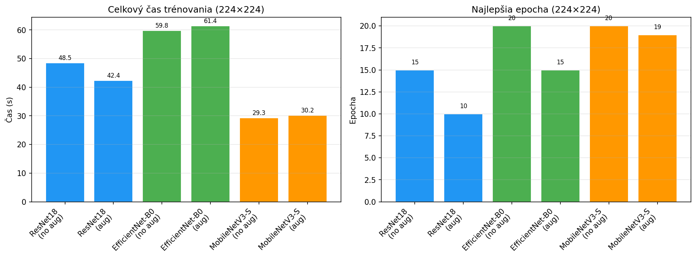
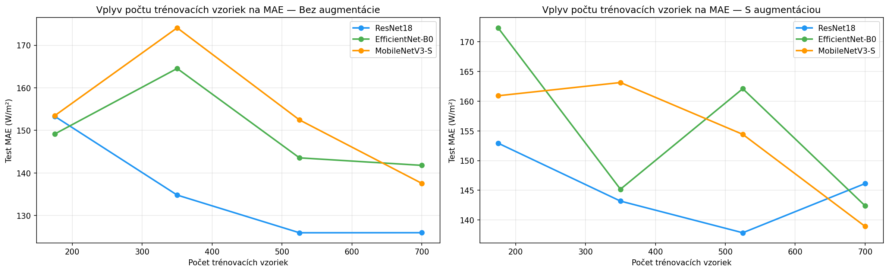

# Vysvetlenia grafov

Tento dokument sa neodovzdáva. Podrobné vysvetlenie každého grafu pre potreby obhajoby.

---

## 1. Porovnanie augmentácie — `aug_comparison_224.png`

### Čo graf ukazuje

Dvojitý stĺpcový (bar) graf. Ľavý panel zobrazuje **MAE** (strednú absolútnu chybu), pravý panel **RMSE** (odmocninu strednej kvadratickej chyby). Obe metriky sú v jednotkách W/m².

Na osi X sú tri modely: ResNet18, EfficientNet-B0, MobileNetV3-S.
Pre každý model sú dva stĺpce vedľa seba:
- **modrý** — výsledok bez augmentácie
- **zelený** — výsledok s rotačnou augmentáciou (0°/90°/180°/270°)

Čísla nad stĺpcami = presná hodnota danej metriky.

Tento graf je pre vstupnú veľkosť **224×224 px** a **plný dataset (100 %)**.

### Čo z grafu vyčítame

Vo všetkých troch modeloch sú **zelené stĺpce vyššie ako modré** — augmentácia teda vo všetkých prípadoch zhoršila výsledky. Toto je hlavný záver celého experimentu.

Najväčší rozdiel je pri **ResNet18** — augmentácia pridala takmer 20 W/m² na MAE. Pri EfficientNete a MobileNete je rozdiel menší (~1 W/m²), čo naznačuje, že tieto menšie siete sú menej citlivé na typ augmentácie.

### Prečo augmentácia zhoršila výsledky

Fotky oblohy majú fyzikálnu orientáciu — horizont je vždy dole, slnko je v hornej časti snímky. Keď obrázok otočíme o 90°, horizont je zrazu na boku, čo je fyzikálne nezmyselné. Model musí ignorovať orientáciu, čím stráca informáciu ktorá je pre predikciu žiarenia kľúčová (výška slnka nad horizontom).

### Na čo si dať pozor pri otázkach

- „Prečo ste vôbec skúšali augmentáciu?" — Bola to výskumná otázka. V iných doménach (mikroskopia, röntgen) rotácia pomáha. Chceli sme overiť, či aj tu.
- „Je to chyba implementácie?" — Nie. Výsledok je konzistentný naprieč všetkými tromi modelmi a všetkými veľkosťami vstupu.
- „Aká iná augmentácia by mohla pomôcť?" — Horizontálny flip (ľavo-pravá symetria oblohy je fyzikálne zmysluplná) alebo zmena jasu/kontrastu.

---

## 2. Vplyv veľkosti vstupu — `input_sizes_mae.png`

### Čo graf ukazuje

Čiarový graf s dvoma panelmi. Ľavý = bez augmentácie, pravý = s augmentáciou.

Na osi X sú tri veľkosti vstupu: 128×128, 224×224, 320×320 pixelov.
Na osi Y je **testové MAE** (W/m²) — nižšie je lepšie.
Každý model má svoju farebnú čiaru s bodmi.

### Čo z grafu vyčítame

**Väčší vstup nepomáha.** Vo väčšine prípadov MAE rastie alebo stagnuje keď zvýšime veľkosť vstupu z 128 na 224 alebo 320.

Najlepší výsledok dosiahol **ResNet18 pri 128px** — a to v oboch paneloch (bez aj s augmentáciou).

**MobileNet** má najmenej stabilnú krivku — jeho výkon kolíše medzi veľkosťami vstupu viac ako ostatné modely.

### Prečo väčší vstup nezlepšil výsledky

Dve príčiny:
1. **Pre odhad žiarenia stačí globálna informácia** — kde je slnko, koľko oblohy pokrývajú oblaky. Tieto veci sú viditeľné aj na 128px. Väčší vstup pridáva detaily (ostrosť hrán oblakov) ktoré pre túto úlohu nie sú dôležité.
2. **Väčší vstup = komplexnejší model = viac rizika overfittingu** — pri 946 obrázkoch nemáme dosť dát na to aby väčší vstup priniesol výhody.

---

## 3. Vplyv learning rate — `lr_effect_224.png`

### Čo graf ukazuje

Čiarový graf s dvoma panelmi. Ľavý = bez augmentácie, pravý = s augmentáciou.

Na osi X sú tri testované learning rates: 0.0001, 0.001, 0.01.
Na osi Y je **testové MAE** (W/m²).

Pozor: os X nie je lineárna — hodnoty sú zobrazené ako reťazce, nie čísla. Skutočné rozostupy sú 0.0001, 0.001, 0.01 — teda každý krok je 10-násobok predchádzajúceho.

### Čo z grafu vyčítame

Pre väčšinu modelov je **LR = 0.001 optimálne** — krivky majú minimum v strednom bode.

Pri **LR = 0.01** (príliš veľké) MAE rastie — optimizer preskakuje cez minimu.
Pri **LR = 0.0001** (príliš malé) MAE je tiež horšie — sieť sa za 20 epoch nestihla dostatočne naučiť.

**ResNet18** je najcitlivejší na voľbu LR — rozdiel medzi najlepším a najhorším LR je u neho najväčší.

### Prečo testujeme viac LR

Optimálne LR závisí od architektúry, veľkosti datasetu aj batch size. Bez experimentu to nevieme vopred. Tým že sme otestovali tri hodnoty a vybrali najlepšiu, zaručíme férové porovnanie modelov.

---

## 4. Komplexnosť modelov — `model_complexity.png`

### Čo graf ukazuje

Jednoduchý stĺpcový graf. Na osi X sú tri modely, na osi Y **počet parametrov** (váh v sieti). Nad každým stĺpcom je hodnota v miliónoch (M).

### Čo z grafu vyčítame

| Model | Parametre |
|-------|-----------|
| ResNet18 | 11,2 M |
| EfficientNet-B0 | 4,0 M |
| MobileNetV3-S | 1,5 M |

ResNet18 má takmer 3× viac parametrov ako EfficientNet a 7× viac ako MobileNet.

### Dôležitý kontext

Napriek najväčšiemu počtu parametrov **ResNet18 dosiahol najlepšie výsledky**. To je zaujímavé — pri malom datasete by sme čakali, že menší model bude lepší (menej rizika overfittingu). Vysvetlenie: ResNet18 má vďaka reziduálnym spojeniam architektonické vlastnosti ktoré lepšie zachytávajú vizuálne vzory v obrázkoch oblohy.

Graf tiež ukazuje, že **počet parametrov ≠ rýchlosť trénovania**. EfficientNet má menej parametrov ako ResNet18, ale trénoval pomalšie (viď `training_time_224.png`).

---

## 5. Predikovaná vs. skutočná hodnota — `pred_vs_actual_224.png`

### Čo graf ukazuje

Scatter plot (bodový graf) pre každý model (bez aug a s aug) — celkovo 6 podgrafov.

Na osi X je **skutočná hodnota žiarenia** (W/m²) — čo naozaj namerial pyranometer.
Na osi Y je **predikovaná hodnota** — čo povedala sieť.

Čierna prerušovaná čiara = ideálna predikcia (skutočná = predikovaná). Čím bližšie sú body k tejto diagonále, tým lepší model.

Nad každým podgrafom je názov modelu, MAE a R².

### Čo z grafu vyčítame

**Systematické podhodnocovanie pri vysokých hodnotách:** Body pri vysokom žiarení (800–1100 W/m²) sú typicky pod diagonálou — model predpovedá nižšie hodnoty ako sú skutočné. Extrémne hodnoty sú v trénovacej množine vzácne, sieť ich teda nevidela dosť a nenaučila sa ich správne predpovedať.

**Rozptyl je veľký pri stredných hodnotách (200–600 W/m²):** Tu je najviac variability — rôzne kombinácie oblačnosti a polohy slnka dávajú podobné žiarenie. Toto je pre model najťažšia oblasť.

**Nulové a nízke hodnoty** (noc, hlboká oblačnosť) sú predikované pomerne dobre — tieto sú v datasete pravdepodobne konzistentné.

### Na čo si dať pozor pri otázkach

- „Prečo sú body rozptýlené a nie na diagonále?" — Pretože odhad žiarenia z jednej fotky je inherentne ťažký. Rovnaká fotka v rôznych geografických polohách môže zodpovedať rôznym hodnotám žiarenia. R² = 0.54 hovorí, že model zachytáva 54 % variability — zvyšok je šum.

---

## 6. Trénovacie krivky — `training_curves_224.png`

### Čo graf ukazuje

Čiarový graf. Na osi X sú **epochy** (kolá trénovania), na osi Y je **validačné MAE** (W/m²) po každej epoche.

Každý model má svoju farbu. Plná čiara = s augmentáciou, prerušovaná čiara = bez augmentácie. Celkovo 6 kriviek.

Graf zobrazuje len výsledky pre vstupnú veľkosť 224×224 px pri najlepšom LR.

### Čo z grafu vyčítame

**Konvergencia:** Všetky krivky klesajú v prvých epochách — model sa učí. Potom sa vyrovnajú alebo mierne rastú (early stopping zastavuje tréning).

**Krivky s augmentáciou (plné čiary) sú väčšinou nad krivkami bez augmentácie (prerušované)** — potvrdenie že augmentácia škodí.

**Počet epoch:** Tréning sa zastavil rôzne skoro pre rôzne modely. Early stopping s patience=7 zastavil tréning akonáhle sa 7 epoch po sebe nezlepšilo validačné MAE.

**Oscilujúce krivky** naznačujú nestabilné trénovanie — typicky pri väčšom LR.

### Na čo si dať pozor pri otázkach

- „Prečo krivky niekedy mierne stúpajú na konci?" — To je early stopping v akcii. Vidíme posledných 7 epoch kde sa model nezlepšoval. Váhy ktoré použijeme na test pochádzajú z najnižšieho bodu krivky.
- „Čo by sa stalo bez early stoppingu?" — Krivky by ďalej rástli (overfitting). Trénovacia strata by klesala, validačná MAE by rástla.

---

## 7. Čas trénovania — `training_time_224.png`

### Čo graf ukazuje

Dva stĺpcové grafy vedľa seba.

**Ľavý panel** — celkový čas trénovania v sekundách pre každý model (bez aug a s aug). Vstupná veľkosť 224×224 px.

**Pravý panel** — číslo epochy kde mal model najlepšie validačné MAE (najlepšia epocha).

Na osi X sú modely rozlíšené názvom a tým, či bola augmentácia zapnutá.

### Čo z grafu vyčítame

**MobileNet je najrýchlejší** — okolo 29 sekúnd na experiment. Má najmenej parametrov (1,5M) a jednoduchšiu architektúru.

**EfficientNet je paradoxne najpomalší** — okolo 60 sekúnd, aj keď má menej parametrov ako ResNet18. Dôvod: EfficientNet používa depthwise separable konvolúcie a squeeze-and-excitation bloky, ktoré sú výpočtovo náročné a menej paralelizovateľné na GPU.

**Augmentácia mierne spomaľuje tréning** — každý obrázok sa musí navyše otočiť, čo pridáva malú réžiu.

**Najlepšia epocha** (pravý panel) ukazuje, kedy model dosiahol optimum. Väčšinou je to niekde medzi 8. a 15. epochou — tréning s patience=7 sa zastavil 7 epoch po tomto bode.

### Praktický záver

Za 216 experimentov celkovo: ~1,5 hodiny na GPU RTX 4060 Ti. Kľúčovú úlohu zohralo prednahratie obrázkov do RAM — bez toho by každý experiment čakal na disk a tréning by trval mnohonásobne dlhšie.

---

## 8. Vplyv veľkosti trénovacej množiny — `train_size_effect.png`

### Čo graf ukazuje

Čiarový graf. Na osi X je **počet trénovacích vzoriek** (nie percento — skutočné čísla vzoriek). Na osi Y je **testové MAE** (W/m²).

Každý model má svoju farebnú čiaru. Zobrazené sú výsledky **s augmentáciou** pre vstupnú veľkosť 224×224 px.

Štyri body na každej krivke zodpovedajú frakciam 25 %, 50 %, 75 %, 100 % trénovacej množiny.

### Čo z grafu vyčítame

**Pri ~175 vzorkách (25 %)** sú výsledky veľmi zlé — MAE je vysoké a R² je záporné (model horší ako predpovedanie priemeru). Sieť nemá dostatok príkladov na zmysluplné učenie.

**Medzi 175 a 330 vzorkami (25 % → 50 %)** je najväčší skok zlepšenia — krivky strmšie klesajú. Toto je „kritický prah" datasetu.

**Od 330 vzoriek nahor** sa krivky vyrovnávajú — ďalšie pridávanie dát stále pomáha, ale čoraz menej.

**ResNet18 profituje z väčšieho datasetu najviac** — krivka klesá strmejšie ako ostatné. Pri malom datasete je jeho výhoda menšia.

### Čo to hovorí o potrebách datasetu

Pre transfer learning na tejto úlohe je minimum ~300–400 vzoriek. S podstatne väčším datasetom (5 000+) by sme mohli použiť väčšie modely a dosiahnuť výrazne lepšie R².

### Na čo si dať pozor pri otázkach

- „Prečo ste nezískal viac dát?" — Eye2Sky dataset je obmedzený na konkrétne stanice a časové obdobie. Rozšírenie by vyžadovalo buď nové merania alebo použitie iného datasetu.
- „Aký je teoretický strop pre tento typ úlohy?" — State-of-the-art metódy s veľkými datasetmi dosahujú R² > 0.90, pričom využívajú aj temporálnu informáciu (sekvencie obrázkov).
